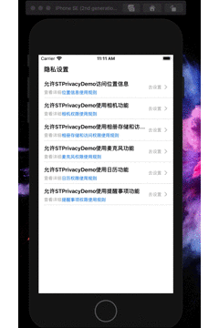

# STPrivacyDemo
A utility class that manages common privacy permissions reference to [ECAuthorizationTools]( https://github.com/EchoZuo/ECAuthorizationTools.git)

**Effect: **



**Useage:**

*Check  Authorization*

```objective-c
[STPrivacyAuthorizationTool checkAuthorizationStatusForType:STPrivacyType_Photos];
```

*Request  Authorization*

```objective-c
 [STPrivacyAuthorizationTool requestAccessForType:STPrivacyType_Photos accessStatus:^(STAuthorizationStatus status, STPrivacyType type) {
                dispatch_async(dispatch_get_main_queue(), ^{
                //do something
                });
            }];
```

*The location function requires a separate function：*

```objective-c
 STPrivacyAuthorizationTool *tool = [[STPrivacyAuthorizationTool alloc]init];
[tool requestLocationAccessStatus:^(STAuthorizationStatus status, STPrivacyType type) {
                dispatch_async(dispatch_get_main_queue(), ^{
                   //do something
                });
            }];
```

Please refer to the demo for specific use  <font color = red>ViewController</font>

